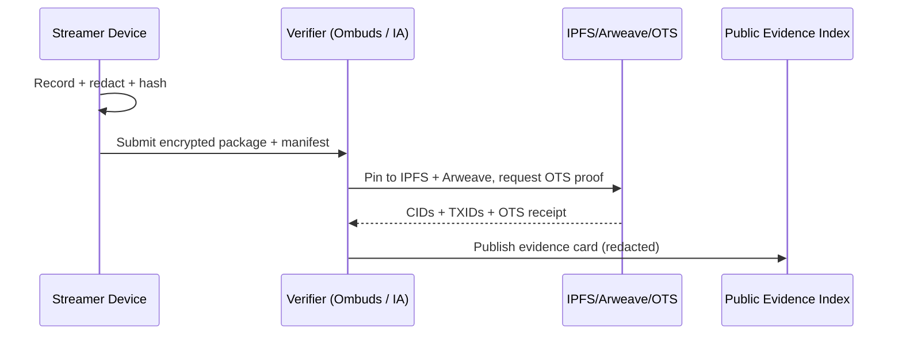

# HeroLens — Trust, On the Record

<div align="center">

**Twitch-style civic livestreams + immutable proof.**
Footage can’t vanish. Real heroes get funded.

[](#)
[](#)
[](#)
[](#)
[](#)
[](#license)

</div>

> \[!IMPORTANT]
> **Purpose.** Restore trust in public institutions by recording frontline service work as **consent-first, redacted, immutable** streams. Evidence is auto-hashed, anchored, and auditable. Micro-funding rewards verified acts of service.

---

## ✨ What makes HeroLens different?

* **“Proof, not promises.”** Chain-of-custody from camera → hash → IPFS/Arweave → OpenTimestamps.
* **Consent-by-design.** Face-blur and PII redaction default **ON**; emergency blackout hotkey <kbd>Ctrl</kbd>+<kbd>Shift</kbd>+<kbd>B</kbd>.
* **Zero-Harm guardrails.** Context-sensitive delays, witness protection modes, and review queues.
* **Civic funding rails.** Tips + gov micro-grants routed to verified **Hero Wallets**.

> \[!NOTE]
> HeroLens is **offline-first**. If the network drops, the encrypted recording continues; anchors publish when connectivity returns.

---

## 🧭 Quickstart (dev preview)

```bash
# 1) Clone
git clone https://github.com/<you>/herolens && cd herolens

# 2) Configure (consent & storage)
cp config/example.herolens.yaml config/herolens.yaml

# 3) Run (local dev)
python -m src.herolens --config config/herolens.yaml
```

<details>
<summary><b>🔐 Minimal <code>config/herolens.yaml</code></b> (click to view)</summary>

```yaml
app:
  node_id: "fm-ab-node01"
  mode: "consent-first"   # consent-first | training | ombuds
recording:
  face_blur: "on"         # on by default
  license_plate_blur: "on"
  audio_denoise: "on"
  pre_buffer_sec: 10
  blackout_hotkey: "ctrl+shift+b"  # local screen goes black; recording continues
immutability:
  ipfs: true
  arweave: true
  ots: true
  publish_delay_sec: 90    # grace window for safety review
privacy:
  geo_fuzz_km: 3.0
  pii_scrub: ["names","addresses","plates"]
funding:
  enable_hero_wallets: true
  allowed_rails: ["gov_microgrant","tips"]
```

</details>

---

## 🧩 System Overview

```mermaid
flowchart LR
    A[Camera + Local Cache] --> B[Redaction Engine\n(face/plate blur, PII scrub)]
    B --> C[Hash + Chunker\n(SHA-256, Merkle map)]
    C --> D[Local Chain-of-Custody Log]
    D --> E[IPFS Pin]
    D --> F[Arweave Bundle]
    D --> G[OpenTimestamps Anchor]
    E --> H[Public Evidence Index]
    F --> H
    G --> H
```

> \[!WARNING]
> **No doxxing.** Public evidence cards use fuzzy geo (±3 km), time windows, and redacted thumbnails. Raw originals stay encrypted under legal custody rules.

---

## 🧪 Chain-of-Custody (sequence)



---

## 📂 Repo Structure (UI-styled)

```text
herolens/
├─ README.md
├─ LICENSE
├─ .github/
│  ├─ ISSUE_TEMPLATE.md
│  └─ workflows/
│     ├─ ci.yml
│     └─ notarize.yml                # anchors hashes to IPFS/Arweave + OTS
├─ src/
│  ├─ herolens/                      # core
│  │  ├─ capture.py
│  │  ├─ redact.py                   # face/plate blur, audio PII scrub
│  │  ├─ hash_chain.py               # Merkle mapping + receipts
│  │  ├─ anchors.py                  # IPFS/Arweave/OTS clients
│  │  └─ wallet.py                   # Hero Wallet payouts & attestations
│  └─ ui/
│     └─ dashboard.py                # local evidence cards + review queue
├─ docs/
│  ├─ safety/zero_harm.md
│  ├─ policy/consent_model.md
│  ├─ legal/chain_of_custody.md
│  └─ schemas/evidence.schema.json
├─ web/
│  └─ index.html                     # static “Public Evidence Index”
├─ datasets/
│  ├─ evidence/                      # redacted cards (public)
│  └─ custody/                       # encrypted originals (restricted)
├─ config/
│  └─ example.herolens.yaml
└─ scripts/
   ├─ export_evidence_card.py
   └─ verify_anchor.py
```

> **PROMPT (docs/safety/zero\_harm.md):** Describe threat models, mitigations, and emergency switching logic (e.g., delayed publish in volatile contexts).

---

## 🛡️ Safety Modes

* **👁️ Redaction First:** Face/plate blur, name scrub in subtitles, watermarking.
* **🕳️ Blackout Mode:** <kbd>Ctrl</kbd>+<kbd>Shift</kbd>+<kbd>B</kbd> hides screen but keeps recording with time-salted hashes.
* **⏱️ Safe Delay:** Configurable publish delay for ombuds review.
* **🎭 Witness Shield:** Mask voices and swap to silhouette thumbnail.

> \[!TIP]
> Keep a **laminated consent card** in frame at start of service interactions. The UI stores a still frame of consent terms + timestamp + signer ID (when appropriate and safe).

---

## 🧾 Evidence Card (public JSON)

```json
{
  "$schema": "./docs/schemas/evidence.schema.json",
  "event_id": "HL-2025-08-23-fm-ab-014",
  "node_id": "fm-ab-node01",
  "time_window": "2025-08-23T15:11Z→15:37Z",
  "geo_fuzz_km": 3.0,
  "media": {
    "preview": "datasets/evidence/HL-...-thumb.jpg",
    "segments": ["ipfs://CID1", "ipfs://CID2"]
  },
  "anchors": {
    "ipfs_root": "Qm...CID",
    "arweave_tx": "ArTxID...",
    "ots_receipt": "base64:..."
  },
  "redaction": ["faces","plates","names"],
  "consent": "on-record",
  "funding_link": "hero://wallet/fm-ab-node01",
  "notes": "Public-interest disclosure; PII removed."
}
```

---

## 💸 Hero Funding (transparent rails)

| Rail             | Who funds    | Release rule          | Audit signal    |
| ---------------- | ------------ | --------------------- | --------------- |
| Tips             | Public       | T+0 on verified event | CID + TXID      |
| Gov micro-grants | Agency       | Milestone-gated       | Batch ledger    |
| Civic pool       | Philanthropy | Quadratic             | Periodic report |

> \[!TIP]
> **Attestations.** Community validators (school, faith group, union) co-sign events to increase payout weight.

---

## 🧱 CI: Notarization Workflow (GitHub Actions)

```yaml
name: notarize
on:
  push:
    paths: ["datasets/evidence/**.json", "datasets/evidence/**.jpg"]
jobs:
  anchor:
    runs-on: ubuntu-latest
    steps:
      - uses: actions/checkout@v4
      - name: Compute hashes
        run: python scripts/verify_anchor.py --scan datasets/evidence
      - name: Pin to IPFS
        run: python -m src.herolens.anchors --ipfs pin --dir datasets/evidence
      - name: Arweave bundle
        run: python -m src.herolens.anchors --arweave bundle datasets/evidence
      - name: OpenTimestamps
        run: python -m src.herolens.anchors --ots stamp evidence.hashes
```

---

## 📊 Roadmap (living)

* M0 ▰▰▰▱▱ **Local capture + redaction**
* M1 ▰▰▱▱▱ **Anchors + receipts**
* M2 ▰▱▱▱▱ **Public evidence index (read-only)**
* M3 ▱▱▱▱▱ **Hero Wallet payouts + attestations**
* M4 ▱▱▱▱▱ **Gov dashboard + ombuds API**

> Check **[Projects](./../../projects)** for sprint boards and velocity.

---

## 🤝 Governance & Ethics

> \[!CAUTION]
> **Non-negotiables.** No weaponization, stalking, or targeted harassment. Default delays in volatile contexts. Opt-out honored when safety allows.

* **Licensing.** Code AGPL-3.0; docs/media **CC BY-NC-SA 4.0** + Zero-Harm Addendum.
* **Ombuds Circle.** Rotating 3-member quorum for disputes and takedowns.
* **Transparency.** All moderator actions produce a signed `decision.json` with reason codes.

<details>
<summary><b>🧠 Zero-Harm Addendum (short form)</b></summary>

* Mandatory redaction defaults; no raw public dumps.
* Fuzzy geo + time windows on evidence cards.
* Clear anti-surveillance clause; bans model training on raw PII.
* Improvements must be shared back; forks inherit the addendum.

</details>

---

## 🧰 Contributing

* Open a draft PR with:

  * ✅ threat model update
  * ✅ redaction test case
  * ✅ anchor verification output (CID/ArTxID/OTS)

Use <kbd>npm run dev</kbd> (web) and <kbd>python -m src.herolens</kbd> (core).
See **`docs/safety/zero_harm.md`** before touching recording paths.

---

## 📣 One-liner / Blurbs

* **Tagline:** *Footage that can’t vanish.*
* **Short:** Twitch-grade civic streams, immutably anchored, consent-first, hero-funded.
* **Elevator:** Public service, on the record. Redacted by default, anchored forever, audited by design.

---

## 🏷️ Credits

Foster + Navi, early ombuds volunteers, and the brave first responders & community heroes who choose radical transparency with compassion.

---

### Bonus UI flourishes you can add later

* **Auto-generated hero badges** (SVG) per event.
* **Dark-mode banner** (SVG) with scanline animation in the README header.
* **Mini “evidence cards”** rendered via GitHub Pages from `datasets/evidence/*.json`.
