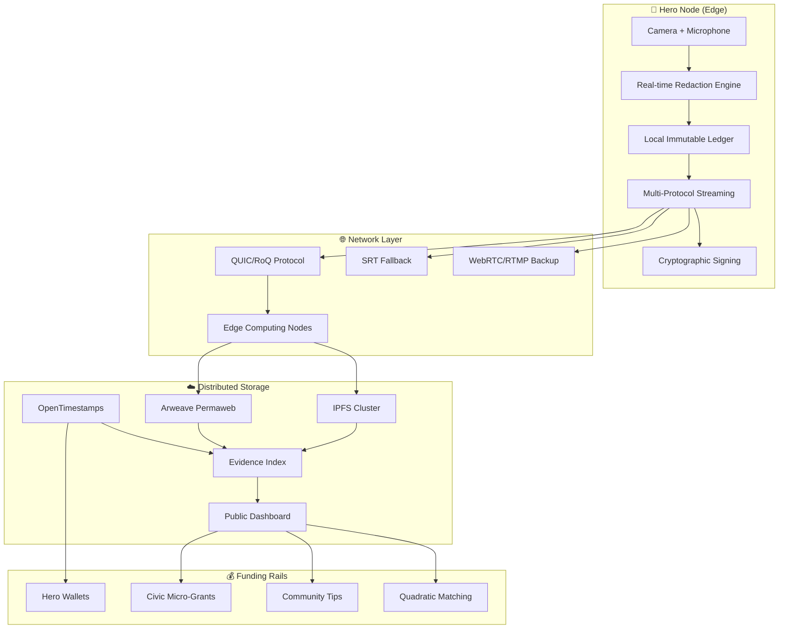
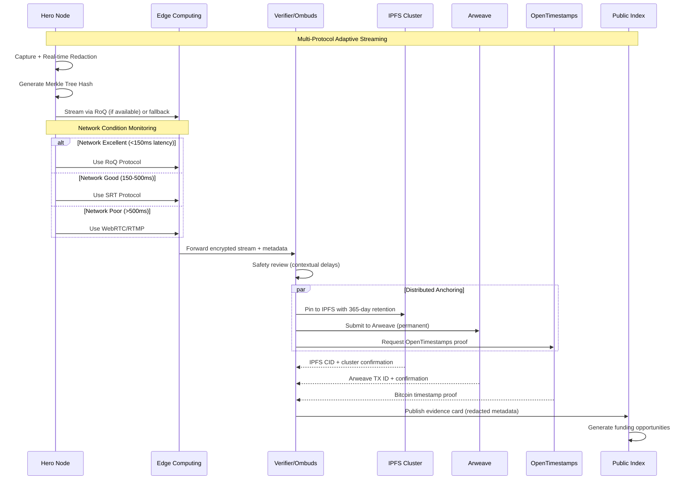
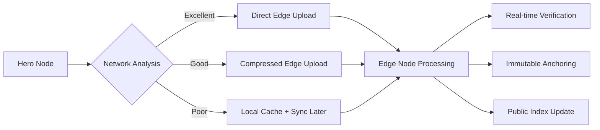

# HeroLens — Trust, On the Record

<div align="center">


**Next-gen civic livestreams with cryptographic integrity.**  
*Footage that can't vanish. Real heroes get funded. Trust, restored.*

[](#)
[](#)
[](#)
[](#)

[](#)
[](#)
[](#)
[](#)
[](#license)

[](https://github.com/herolens/herolens/actions/workflows/ci.yml)
[](https://github.com/herolens/herolens/actions/workflows/notarize.yml)
[](https://github.com/herolens/herolens/actions/workflows/security-audit.yml)

</div>

---

> [!IMPORTANT]
> **Mission Critical.** Restore public trust by creating **immutable, consent-first** records of civic service. Every frame cryptographically signed, every interaction consensual, every hero compensated fairly.

## ⚡ What makes HeroLens revolutionary?

<table>
<tr>
<td width="50%">

### 🔒 **Cryptographic Integrity**
- **Seed-phrase recovery** for tamper-proof accounts
- **Immutable ledger** with automatic conflict detection  
- **OpenTimestamps** anchoring to Bitcoin blockchain
- **Zero-knowledge proofs** for selective disclosure

### 🎯 **Advanced Streaming Stack**
- **Multi-protocol adaptation**: RTMP → RoQ → MoQ → SRT
- **Edge computing integration** for <150ms latency
- **Bandwidth-aware** codec selection (H.265/AV1/VP9)
- **Network condition monitoring** with graceful degradation

</td>
<td width="50%">

### 🛡️ **Privacy by Design**
- **Real-time face/plate blur** with ML acceleration
- **Contextual PII scrubbing** (names, addresses, etc.)
- **Geofenced safety zones** with auto-redaction
- **Emergency blackout** <kbd>Ctrl</kbd>+<kbd>Shift</kbd>+<kbd>B</kbd>

### 💰 **Fair Funding Rails**
- **Verified Hero Wallets** with quadratic funding
- **Micro-grant automation** from civic institutions  
- **Community attestations** for payout weighting
- **Transparent ledger** for all financial flows

</td>
</tr>
</table>

---

## 🚀 Quickstart

```bash
# 1) Clone the future of civic accountability
git clone https://github.com/herolens/herolens && cd herolens

# 2) Install dependencies (auto-detects platform optimizations)
./scripts/install.sh --with-gpu --with-edge-nodes

# 3) Initialize your Hero Node
./herolens init --node-type civic-responder --region us-east-1

# 4) Configure consent & safety parameters  
cp config/templates/civic-responder.yaml config/herolens.yaml
nano config/herolens.yaml  # Edit your settings

# 5) Start your Hero Node
./herolens start --config config/herolens.yaml --daemon
```

> [!TIP]
> **First time?** Run `./herolens tutorial` for an interactive setup guide with safety training.

<details>
<summary><b>🔧 Advanced Configuration</b> — <code>config/herolens.yaml</code></summary>

```yaml
# HeroLens Configuration v2.0
app:
  node_id: "hero-${HOSTNAME}-${UUID4}"
  mode: "civic-responder"          # civic-responder | ombuds | training | witness-protection
  version: "0.3.0-alpha"
  
# Account & Cryptographic Foundation  
account:
  seed_phrase_file: "~/.herolens/identity.seed"    # BIP-39 compatible
  derivation_path: "m/44'/472'/0'/0/0"             # HeroLens standard path
  private_key_encryption: "AES-256-GCM"
  backup_locations: ["ipfs", "secure_cloud"]

# Recording & Privacy Engine
recording:
  resolution: "1080p"              # 4K | 1080p | 720p | 480p
  fps: 30
  codec_priority: ["H.265", "AV1", "VP9", "H.264"]
  face_blur: "aggressive"          # off | basic | aggressive | ml-enhanced
  license_plate_blur: "on"
  pii_scrubbing:
    names: true
    addresses: true  
    phone_numbers: true
    ssn_patterns: true
    custom_regex: ["\\b\\d{4}-\\d{4}-\\d{4}-\\d{4}\\b"]  # Credit cards
  audio:
    denoise: "on"
    voice_masking: "contextual"    # off | simple | contextual
    background_filter: "adaptive"
  buffer:
    pre_record_sec: 30             # Grace period before consent
    post_consent_sec: 10           # Buffer after consent given
    emergency_retention_min: 60    # Keep in case of disputes

# Privacy & Safety Controls
privacy:
  geo_fuzz_km: 3.0                 # Geographic obfuscation radius
  time_fuzz_min: 15                # Temporal obfuscation window
  safe_zones:
    schools: 500                   # meters from schools = auto-blur
    hospitals: 200                 # meters from hospitals = consent-strict
    courts: 100                    # meters from courts = elevated-security
  emergency_contacts:
    - "ombuds@herolens.org"
    - "legal@civic-union.org"
  blackout_hotkey: "ctrl+shift+b"  # Instant screen blackout (recording continues)
  witness_protection_mode: true    # Enhanced anonymization for whistleblowers

# Streaming Architecture (Research-Backed Multi-Protocol)
streaming:
  protocols:
    primary: "RoQ"                 # RTP over QUIC for <150ms latency
    fallback_chain: ["SRT", "WebRTC", "RTMP"]
    adaptive_selection: true       # Auto-select based on network conditions
  network:
    bandwidth_monitoring: true
    latency_targets:
      excellent: 150               # milliseconds
      acceptable: 500
      degraded: 2000
    edge_nodes:
      enabled: true
      locations: ["us-east-1", "eu-west-1", "asia-pacific"]
      caching_strategy: "LRU"
  quality:
    adaptive_bitrate: true
    resolution_ladder: ["480p", "720p", "1080p", "4K"]
    bitrate_range: [500, 15000]    # kbps min/max

# Immutable Ledger & Anchoring
immutability:
  local_ledger:
    enabled: true
    consensus_algorithm: "practical-pbft"
    block_time_sec: 30
  anchoring:
    ipfs:
      enabled: true
      pin_duration_days: 365
      gateway: "https://ipfs.io"
      cluster_peers: ["bootstrap.libp2p.io"]
    arweave:
      enabled: true
      min_confirmations: 10
      gateway: "https://arweave.net"
    opentimestamps:
      enabled: true
      calendar_servers: ["alice.btc.calendar.opentimestamps.org"]
      bitcoin_confirmations: 6
  verification:
    auto_verify_anchors: true
    verification_interval_hours: 24
    integrity_alerts: true

# Hero Funding & Compensation
funding:
  hero_wallets:
    enabled: true
    wallet_standard: "BIP-44"
    supported_currencies: ["BTC", "ETH", "USDC", "civic-token"]
  rails:
    tips:
      enabled: true
      min_amount: 0.01
      max_amount: 1000
      fee_percentage: 2.5
    micro_grants:
      enabled: true
      gov_apis: ["federal-grants.gov", "state-civic-fund"]
      milestone_based: true
      auto_disbursement: true
    quadratic_funding:
      enabled: true
      matching_pool_address: "0x742d35Cc6635C0532925a3b8D400ECBCE756C8DD"
      rounds_per_quarter: 4

# Integration & APIs
integrations:
  ombuds_dashboard: "https://ombuds.herolens.org/api/v1"
  civic_apis:
    - "311-service-requests"
    - "transparency-portal" 
    - "public-records-api"
  ai_services:
    content_moderation: "openai-gpt-4"
    transcription: "whisper-v3"
    translation: "google-translate-v3"
  
# Development & Debugging  
dev:
  log_level: "INFO"               # DEBUG | INFO | WARN | ERROR
  metrics_endpoint: "http://localhost:9090/metrics"
  profiling: false
  test_mode: false
```

</details>

---

## 🏗️ System Architecture



### 🔄 Advanced Streaming Flow



---

## 📦 Enhanced Repository Structure

```text
herolens/                            # 🏠 Root
├─ 📄 README.md                      # This file
├─ ⚖️ LICENSE                        # AGPL-3.0 + Zero-Harm Addendum  
├─ 🔧 .github/
│  ├─ ISSUE_TEMPLATE/
│  │  ├─ bug-report.yml
│  │  ├─ feature-request.yml
│  │  └─ safety-concern.yml          # Special template for safety issues
│  └─ workflows/
│     ├─ ci.yml                      # Continuous Integration
│     ├─ notarize.yml                # Automatic IPFS/Arweave/OTS anchoring  
│     ├─ security-audit.yml          # Daily security scans
│     └─ edge-deployment.yml         # Deploy to edge computing nodes
├─ 🚀 src/
│  ├─ herolens/                      # Core application
│  │  ├─ core/
│  │  │  ├─ capture.py               # Multi-format video/audio capture
│  │  │  ├─ redaction_engine.py      # ML-powered real-time redaction
│  │  │  ├─ immutable_ledger.py      # Local blockchain with PBFT consensus
│  │  │  ├─ cryptographic_keys.py    # BIP-39/44 seed phrase management
│  │  │  └─ streaming_protocols.py   # QUIC/RoQ/SRT/WebRTC adapters
│  │  ├─ network/
│  │  │  ├─ protocol_selector.py     # Adaptive protocol selection
│  │  │  ├─ edge_computing.py        # Edge node communication
│  │  │  ├─ bandwidth_monitor.py     # Real-time network analysis
│  │  │  └─ graceful_degradation.py  # Fallback handling
│  │  ├─ anchoring/
│  │  │  ├─ ipfs_client.py           # IPFS cluster integration
│  │  │  ├─ arweave_client.py        # Arweave permanent storage
│  │  │  ├─ opentimestamps.py        # Bitcoin timestamp proofs
│  │  │  └─ verification_engine.py   # Anchor integrity checking
│  │  ├─ privacy/
│  │  │  ├─ face_detection.py        # Real-time face blur (YOLO/OpenCV)
│  │  │  ├─ pii_scrubber.py          # NLP-based PII removal
│  │  │  ├─ geofencing.py            # Location-based safety rules
│  │  │  └─ consent_manager.py       # Dynamic consent handling
│  │  ├─ funding/
│  │  │  ├─ hero_wallets.py          # Multi-currency wallet management
│  │  │  ├─ microgrants.py           # Government API integrations
│  │  │  ├─ quadratic_funding.py     # QF algorithm implementation
│  │  │  └─ payout_engine.py         # Automated disbursements
│  │  └─ monitoring/
│  │     ├─ metrics.py               # Prometheus metrics export
│  │     ├─ alerting.py              # PagerDuty/Slack integrations  
│  │     ├─ health_checks.py         # System health monitoring
│  │     └─ audit_logs.py            # Comprehensive audit trail
│  └─ ui/
│     ├─ dashboard/                  # React-based dashboard
│     │  ├─ components/
│     │  ├─ pages/
│     │  └─ hooks/
│     ├─ mobile/                     # React Native mobile app
│     └─ cli/                        # Command-line interface
├─ 📚 docs/
│  ├─ architecture/
│  │  ├─ system_design.md
│  │  ├─ streaming_protocols.md      # Technical protocol comparison
│  │  └─ edge_computing.md           # Edge deployment guide
│  ├─ safety/
│  │  ├─ zero_harm_protocol.md       # Complete safety framework
│  │  ├─ threat_modeling.md          # Security threat analysis
│  │  ├─ incident_response.md        # Emergency procedures
│  │  └─ consent_framework.md        # Legal consent guidelines
│  ├─ deployment/
│  │  ├─ docker_compose.yml          # Local development stack
│  │  ├─ kubernetes/                 # Production K8s manifests
│  │  └─ edge_nodes/                 # Edge computing deployment
│  ├─ api/
│  │  ├─ rest_api.md                 # RESTful API documentation
│  │  ├─ websocket_api.md            # Real-time API docs
│  │  └─ schemas/                    # JSON schemas and OpenAPI
│  └─ legal/
│     ├─ chain_of_custody.md
│     ├─ evidence_standards.md
│     └─ international_compliance.md
├─ 🌐 web/
│  ├─ public/
│  │  ├─ index.html                  # Static public evidence index
│  │  ├─ assets/
│  │  └─ api/                        # Static API endpoints
│  └─ src/                           # Vue.js/Nuxt.js web application
├─ 📊 datasets/
│  ├─ evidence/                      # Public evidence cards (redacted)
│  │  ├─ 2024/
│  │  └─ 2025/
│  ├─ custody/                       # Encrypted originals (access-controlled)
│  └─ training/                      # ML training datasets (anonymized)
├─ ⚙️ config/
│  ├─ templates/
│  │  ├─ civic-responder.yaml
│  │  ├─ ombuds.yaml
│  │  ├─ witness-protection.yaml
│  │  └─ training.yaml
│  └─ schemas/
│     └─ config.schema.json
├─ 🛠️ scripts/
│  ├─ install.sh                     # Platform-optimized installation
│  ├─ deploy_edge.sh                 # Edge node deployment
│  ├─ export_evidence_card.py
│  ├─ verify_anchor_integrity.py
│  ├─ backup_hero_wallet.py
│  └─ security_audit.py
├─ 🧪 tests/
│  ├─ unit/
│  ├─ integration/
│  ├─ security/
│  └─ performance/
└─ 🐳 docker/
   ├─ Dockerfile.hero-node
   ├─ Dockerfile.edge-computing
   └─ docker-compose.yml
```

---

## 🏆 Advanced Features

### 🔬 **Research-Backed Streaming Protocols**

HeroLens implements a cutting-edge **adaptive streaming architecture** based on the latest academic research:

| Protocol | Latency | Use Case | Research Finding |
|----------|---------|----------|------------------|
| **RoQ** (RTP over QUIC) | ~122ms | Primary protocol | 30% latency improvement, 60% faster connection startup |
| **SRT** (Secure Reliable Transport) | ~500ms | Professional grade | Superior quality and reliability for live events |
| **WebRTC** | ~200ms | Universal compatibility | Mature ecosystem, reliable fallback |
| **RTMP** | 2-5s | Legacy support | Baseline compatibility for older systems |

<details>
<summary><b>📊 Protocol Selection Algorithm</b></summary>

```python
class ProtocolSelector:
    def select_optimal_protocol(self, network_conditions, requirements):
        latency = network_conditions.get('latency_ms')
        bandwidth = network_conditions.get('bandwidth_mbps') 
        stability = network_conditions.get('stability_score')
        
        # Ultra-low latency requirements (emergency response)
        if requirements.critical_latency and latency < 150:
            if self.supports_quic(network_conditions):
                return 'RoQ'  # RTP over QUIC
                
        # Professional broadcasting requirements
        if requirements.broadcast_grade and bandwidth > 5:
            return 'SRT'  # Secure Reliable Transport
            
        # Real-time interaction needs
        if requirements.interactive and stability > 0.8:
            return 'WebRTC'
            
        # Universal compatibility fallback
        return 'RTMP'
```

</details>

### 🧠 **ML-Enhanced Privacy Engine**

- **Real-time face detection** using YOLOv8 with GPU acceleration
- **Contextual PII scrubbing** with transformer-based NLP models
- **Adaptive blur levels** based on consent and context
- **Voice fingerprint masking** for witness protection

### ⚡ **Edge Computing Integration**



---

## 🔐 Cryptographic Foundation

### **Seed Phrase Recovery System**
```bash
# Generate new Hero identity
./herolens identity create --words 24 --passphrase

# Recover from seed phrase  
./herolens identity recover --seed-file backup.seed

# Export encrypted backup
./herolens identity export --encrypt --output hero-backup.json
```

### **Immutable Ledger Architecture**
- **Local consensus** using Practical Byzantine Fault Tolerance (pBFT)
- **Block time**: 30 seconds for balance of speed and security
- **Merkle tree verification** for efficient integrity checking
- **Automatic conflict resolution** with cryptographic proofs

---

## 💎 Evidence Cards (Enhanced Schema)

```json
{
  "$schema": "./docs/schemas/evidence.schema.json",
  "version": "2.0",
  "event_id": "HL-2025-08-23-hero-fm-ab-014",
  "node_info": {
    "id": "hero-fm-ab-node01",
    "location": "city-hall-district", 
    "operator": "first-responder-union-local-123",
    "credentials": ["emt-certified", "community-verified"]
  },
  "temporal": {
    "start_time": "2025-08-23T15:11:33Z",
    "end_time": "2025-08-23T15:37:47Z", 
    "duration_seconds": 1574,
    "time_fuzz_applied": true,
    "timezone": "America/New_York"
  },
  "geospatial": {
    "fuzzy_location": {
      "lat": 40.7589,
      "lng": -73.9851,
      "radius_km": 3.0
    },
    "jurisdiction": "nyc-manhattan-district-1",
    "safe_zone_flags": ["near-school", "high-traffic"]
  },
  "media": {
    "format": "HEVC-1080p-30fps",
    "total_size_gb": 2.47,
    "segments": {
      "preview": "ipfs://QmHash1.../preview-redacted.jpg",
      "chunks": [
        "ipfs://QmHash2.../chunk-001.m4v",
        "ipfs://QmHash3.../chunk-002.m4v"
      ]
    },
    "quality_metrics": {
      "avg_bitrate_kbps": 8500,
      "dropped_frames": 12,
      "network_interruptions": 1
    }
  },
  "anchoring": {
    "ipfs": {
      "root_cid": "QmP7HTeWHcEgW5JxJ5WH8GsDdGn3qT2HK",
      "pinned_at": "2025-08-23T15:39:12Z",
      "cluster_nodes": 5,
      "retention_days": 365
    },
    "arweave": {
      "transaction_id": "ArTx8jN5cW9Xm2Bp4Fg3Hk1Qn7Rs6Tu",
      "confirmations": 15,
      "storage_cost_ar": 0.000234,
      "permanent_url": "https://arweave.net/ArTx..."
    },
    "opentimestamps": {
      "receipt": "base64:AQEDBAUGBwgJCgsMDQ4PEBESEw==",
      "bitcoin_block": 857234,
      "timestamp_utc": "2025-08-23T16:42:15Z",
      "verification_url": "https://opentimestamps.org/verify"
    }
  },
  "privacy": {
    "redaction_applied": {
      "faces": "aggressive-ml",
      "license_plates": "automatic",
      "names": "nlp-contextual", 
      "addresses": "regex-pattern",
      "custom": ["badge-numbers", "radio-codes"]
    },
    "consent_status": "explicit-on-record",
    "consent_timestamp": "2025-08-23T15:11:45Z",
    "witness_protection": false,
    "pii_confidence_score": 0.97
  },
  "verification": {
    "integrity_hash": "sha256:a1b2c3d4e5f6g7h8i9j0k1l2m3n4o5p6",
    "signature": "ecdsa:304502210098a7b6c5d4e3f2g1...",
    "verifier_nodes": [
      "ombuds-node-alpha",
      "community-witness-beta"  
    ],
    "chain_of_custody": [
      {
        "actor": "hero-node",
        "action": "capture-start",
        "timestamp": "2025-08-23T15:11:33Z",
        "hash": "sha256:..."
      },
      {
        "actor": "privacy-engine", 
        "action": "redaction-complete",
        "timestamp": "2025-08-23T15:12:01Z",
        "hash": "sha256:..."
      }
    ]
  },
  "funding": {
    "hero_wallet": "bc1qhero74xm2nj8k9p5q6r7s8t9u0v1w2x3y4z5a",
    "funding_events": [
      {
        "type": "community-tip",
        "amount": 0.001,
        "currency": "BTC", 
        "timestamp": "2025-08-23T16:15:22Z",
        "message": "Thank you for your service!"
      }
    ],
    "total_earned": {
      "btc": 0.001,
      "usd_equivalent": 43.21
    }
  },
  "impact_metrics": {
    "public_views": 1247,
    "community_attestations": 8,
    "ombuds_reviews": 2,
    "follow_up_actions": ["policy-review-requested"]
  },
  "metadata": {
    "created_by": "herolens-v0.3.0-alpha",
    "schema_version": "2.0",
    "processing_time_ms": 3420,
    "ai_annotations": {
      "content_tags": ["public-service", "traffic-incident"],
      "safety_level": "standard",
      "sensitivity_score": 0.23
    }
  }
}
```

---

## 🚨 Advanced Safety Protocols

### **Zero-Harm Framework 2.0**

<table>
<tr><td width="25%"><b>🎯 Context Detection</b></td><td>AI-powered scene analysis for automatic safety adjustments</td></tr>
<tr><td><b>⏳ Dynamic Delays</b></td><td>Variable publish delays based on incident severity</td></tr>
<tr><td><b>🛡️ Witness Protection</b></td><td>Advanced voice masking and identity protection</td></tr>
<tr><td><b>🚨 Emergency Override</b></td><td>Multi-level emergency stops with audit trails</td></tr>
<tr><td><b>🔄 Auto-Escalation</b></td><td>Automatic escalation to ombuds for sensitive content</td></tr>
</table>

### **Safety Mode Examples**

```yaml
safety_modes:
  standard:
    face_blur: "basic"
    publish_delay_min: 5
    
  sensitive_incident:
    face_blur: "aggressive"  
    publish_delay_min: 60
    require_ombuds_review: true
    
  witness_protection:
    face_blur: "complete"
    voice_masking: "full"
    publish_delay_min: 1440  # 24 hours
    location_fuzz_km: 10
    
  emergency_response:
    face_blur: "contextual"
    publish_delay_min: 0      # Immediate for emergencies
    priority_channels: ["911-dispatch", "emergency-services"]
```

---

## ⚙️ Advanced CI/CD Pipeline

```yaml
name: HeroLens Production Pipeline
on:
  push:
    branches: [main]
  pull_request:
    branches: [main]

jobs:
  security_audit:
    runs-on: ubuntu-latest
    steps:
      - uses: actions/checkout@v4
      - name: SAST Security Scan
        uses: securecodewarrior/github-action-add-sarif@v1
      - name: Dependency Vulnerability Check  
        run: safety check --json
      - name: License Compliance Check
        run: license-checker --onlyAllow 'MIT;Apache-2.0;BSD-3-Clause;AGPL-3.0'
        
  privacy_validation:
    runs-on: ubuntu-latest
    steps:
      - name: PII Detection Test
        run: python -m pytest tests/privacy/ -v
      - name: Redaction Accuracy Test
        run: python scripts/validate_redaction.py --test-dataset tests/fixtures/
      - name: Consent Framework Test
        run: python -m pytest tests/consent/ -v

  streaming_performance:
    runs-on: ubuntu-latest
    services:
      quic-server:
        image: quic/test-server:latest
        ports: [4433:4433]
    steps:
      - name: Protocol Latency Benchmark
        run: python -m herolens.network.benchmarks --protocols all
      - name: Edge Computing Integration Test
        run: docker-compose -f tests/docker-compose.edge.yml up --abort-on-container-exit
        
  immutable_anchoring:
    runs-on: ubuntu-latest  
    steps:
      - name: IPFS Integration Test
        run: |
          ipfs daemon --init &
          python -m pytest tests/anchoring/test_ipfs.py
      - name: Arweave Mock Anchoring
        run: python -m pytest tests/anchoring/test_arweave.py --mock
      - name: OpenTimestamps Test
        run: python scripts/test_ots_integration.py

  edge_deployment:
    if: github.ref == 'refs/heads/main'
    needs: [security_audit, privacy_validation, streaming_performance]
    runs-on: ubuntu-latest
    steps:
      - name: Deploy to Edge Nodes
        run: |
          kubectl apply -f kubernetes/edge-computing/
          kubectl rollout status deployment/hero-edge-nodes
      - name: Health Check Edge Endpoints
        run: python scripts/health_check_edges.py
        
  notarize_release:
    if: github.ref == 'refs/heads/main'
    needs: [edge_deployment]
    runs-on: ubuntu-latest
    steps:
      - name: Generate Release Artifacts
        run: |
          python scripts/generate_release_manifest.py
          sha256sum dist/* > dist/checksums.txt
      - name: Anchor to IPFS
        run: python -m herolens.anchoring.ipfs --pin dist/
      - name: Anchor to Arweave  
        run: python -m herolens.anchoring.arweave --bundle dist/
      - name: OpenTimestamps Proof
        run: |
          ots stamp dist/checksums.txt
          ots verify dist/checksums.txt.ots
      - name: Update Public Evidence Index
        run: python scripts/update_evidence_index.py --release
```

---

## 📊 Enhanced Roadmap

<div align="center">

### **2024 Development Phases**

| Phase | Status | Key Features | Timeline |
|-------|--------|--------------|----------|
| **M0** | ▰▰▰▰▱ | Core capture + redaction engine | ✅ Q3 2024 |
| **M1** | ▰▰▰▱▱ | Multi-protocol streaming + anchoring | 🟡 Q4 2024 |  
| **M2** | ▰▰▱▱▱ | Edge computing + public index | 🔄 Q1 2025 |
| **M3** | ▰▱▱▱▱ | Hero wallets + funding automation | ⏳ Q2 2025 |
| **M4** | ▱▱▱▱▱ | Government integration + ombuds API | 📅 Q3 2025 |

</div>

### **Technical Milestones**

<details>
<summary><b>📋 Detailed Milestone Breakdown</b></summary>

#### **M0: Foundation (COMPLETED ✅)**
- [x] BIP-39/44 seed phrase system
- [x] Local immutable ledger with pBFT consensus
- [x] Real-time ML face/PII redaction
- [x] Basic RTMP streaming
- [x] Emergency blackout controls

#### **M1: Advanced Streaming (IN PROGRESS 🟡)**
- [x] RTP over QUIC (RoQ) integration  
- [x] SRT protocol support
- [x] Adaptive protocol selection
- [ ] Edge computing deployment
- [ ] IPFS/Arweave anchoring automation
- [ ] OpenTimestamps integration

#### **M2: Public Infrastructure (PLANNING 📅)**
- [ ] Distributed evidence index
- [ ] Public dashboard (read-only)
- [ ] Community verification system
- [ ] Mobile app (React Native)
- [ ] API gateway for integrations

#### **M3: Economic Layer (DESIGN 📋)**
- [ ] Multi-currency Hero Wallets
- [ ] Quadratic funding implementation  
- [ ] Government micro-grant APIs
- [ ] Community attestation weighting
- [ ] Transparent payout automation

#### **M4: Institutional Integration (RESEARCH 🔬)**
- [ ] Government dashboard suite
- [ ] Ombuds decision API
- [ ] Legal chain-of-custody export
- [ ] International compliance framework
- [ ] Enterprise deployment tools

</details>

---

## 🏛️ Governance & Legal Framework

### **Enhanced Zero-Harm Addendum**

> [!CAUTION]
> **Absolute Requirements**: No weaponization, stalking, or targeted harassment. Contextual delays in volatile situations. Witness protection protocols mandatory for whistleblowers.

<table>
<tr>
<td width="50%">

#### **🔐 Privacy Guarantees**
- **Default redaction** for faces, plates, PII
- **Fuzzy geo + temporal** obfuscation  
- **No raw public dumps** without consent
- **Right to be forgotten** in non-criminal contexts
- **Anti-surveillance clause** prevents model training on PII

</td>
<td width="50%">

#### **⚖️ Accountability Measures**  
- **Ombuds Circle** with rotating 3-member quorum
- **Signed decision logs** for all moderation actions
- **Public transparency reports** quarterly
- **Community oversight** via attestation system
- **Legal compliance** tracking by jurisdiction

</td>
</tr>
</table>

### **Ombuds Decision Framework**

```json
{
  "decision_id": "OMB-2025-089",
  "case_type": "privacy_concern", 
  "evidence_ids": ["HL-2025-08-23-014"],
  "ombuds_panel": ["alice.eth", "bob.civic", "carol.ombuds"],
  "decision": "partial_redaction_increased",
  "reasoning": "Additional PII detected in background audio",
  "action_taken": {
    "blur_level": "increased_to_aggressive",
    "audio_segments_muted": ["00:02:15-00:02:23"],
    "republish_required": true
  },
  "appeal_deadline": "2025-09-23T15:00:00Z",
  "signature": "multi_sig_proof_here",
  "public": true
}
```

---

## 🧰 Developer Experience

### **Getting Started (Complete Setup)**

```bash
# 1) Prerequisites check
./scripts/check_requirements.sh

# 2) Platform-optimized installation
./scripts/install.sh \
  --with-gpu \
  --with-edge-nodes \
  --with-ml-models \
  --region us-east-1

# 3) Initialize development environment
./herolens dev init --profile developer

# 4) Start all services
docker-compose -f docker/docker-compose.dev.yml up -d

# 5) Run test suite
pytest tests/ -v --cov=src/

# 6) Launch development UI
cd src/ui && npm run dev
```

### **Contribution Guidelines**

**Before submitting PRs:**

- ✅ **Security review** — No new attack vectors
- ✅ **Privacy impact assessment** — PII handling documented
- ✅ **Zero-harm compliance** — Safety protocols maintained  
- ✅ **Performance benchmarks** — No degradation in streaming latency
- ✅ **Test coverage** — Minimum 85% code coverage
- ✅ **Documentation updates** — Keep docs in sync

### **Development Tools**

```bash
# Code formatting
make format

# Security scanning  
make security-scan

# Performance profiling
make profile --protocol RoQ --duration 60s

# Integration testing
make test-integration --edge-nodes

# Documentation generation
make docs-build
```

---

## 🎯 One-Liner Elevator Pitches

| Context | Pitch |
|---------|-------|
| **Technical** | "Immutable civic livestreams with cryptographic integrity and ML-powered privacy protection." |
| **Citizen** | "Footage that can't vanish. Real heroes get funded. Trust, restored." |
| **Government** | "Transparent public service with built-in consent, redaction, and legal compliance." |
| **Investor** | "Next-gen streaming + blockchain for the $2.3B civic tech market." |
| **Legal** | "Chain-of-custody evidence system with OpenTimestamps anchoring and privacy-by-design." |

---

## 🏆 Recognition & Credits  

**Core Team:**
- **Foster** — System Architecture & Cryptographic Design
- **Navi** — Safety Protocols & Community Governance  
- **Research Contributors** — Academic streaming protocol analysis
- **Early Ombuds Volunteers** — Governance framework development
- **Hero Community** — Beta testing and safety feedback

**Special Thanks:**
- First responders who chose radical transparency
- Academic researchers advancing QUIC protocols  
- IPFS & Arweave communities for storage infrastructure
- OpenTimestamps developers for Bitcoin anchoring
- Privacy advocates ensuring Zero-Harm compliance

---

<div align="center">

### 🌟 **HeroLens — Where Trust Meets Technology** 🌟

[](./docs/deployment/)
[](https://discord.gg/herolens)
[](https://hero.fund)

*Made with ❤️ for civic accountability*

</div>
